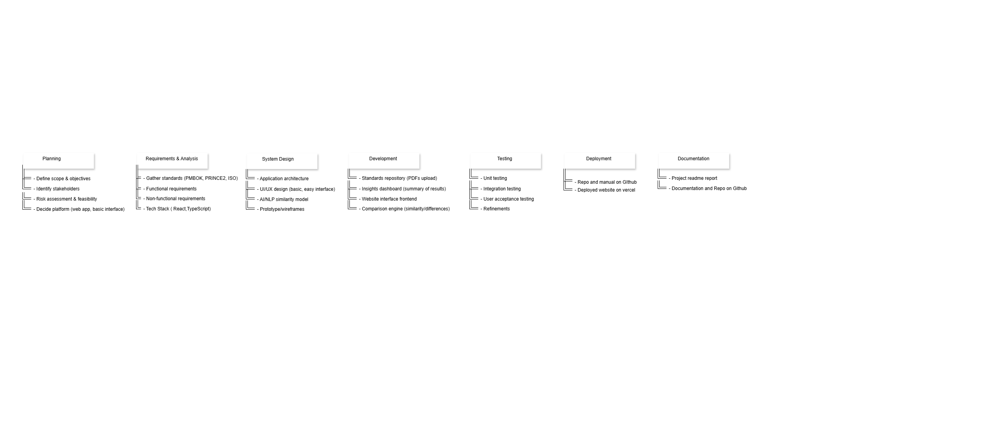

# PRISMO

A minimal web application for comparing and exploring project management standards — **PMBOK 7th Edition**, **PRINCE2**, and **ISO 21500/21502**.
The app provides a **Google-like interface** where users can search for topics (e.g., *Risk Management*) and view relevant sections across the three standards. Results can be filtered to show **Similarities**, **Differences**, or **Unique Points**.

## Live Demo

[View App](https://pm-assignment01.vercel.app/)

## Features

* Search across PMBOK, PRINCE2, and ISO standards.
* View results in a clean, familiar search interface.
* Toggle between **Similarities**, **Differences**, and **Unique Points**.
* Direct access to full standard documents via quick-links.

## Purpose

This project was built as part of a **Project Management assignment**, focusing on applying PM standards in a digital solution. The emphasis is on **clarity, usability, and process design** rather than complex coding.

## WBS

## Authors

Built by [MAB / Malaika Fayyaz - Areeba Atif - Bareera Hanif Butt] for Project Management Course.
